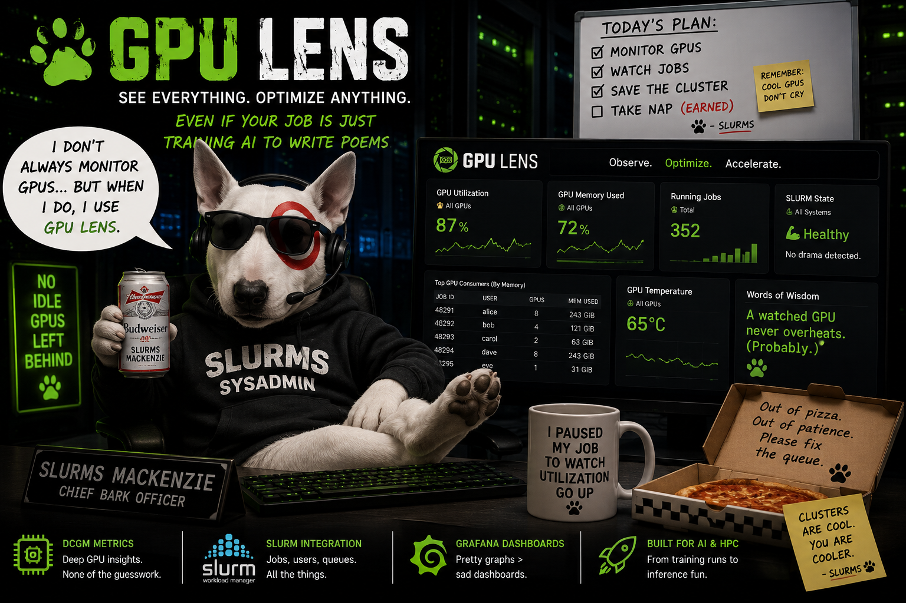
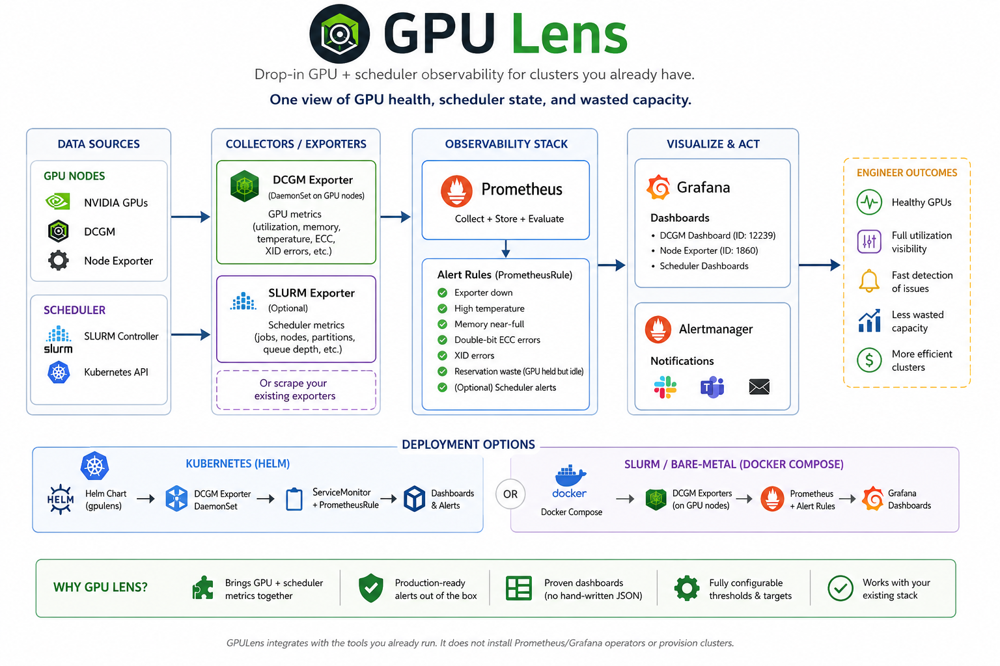
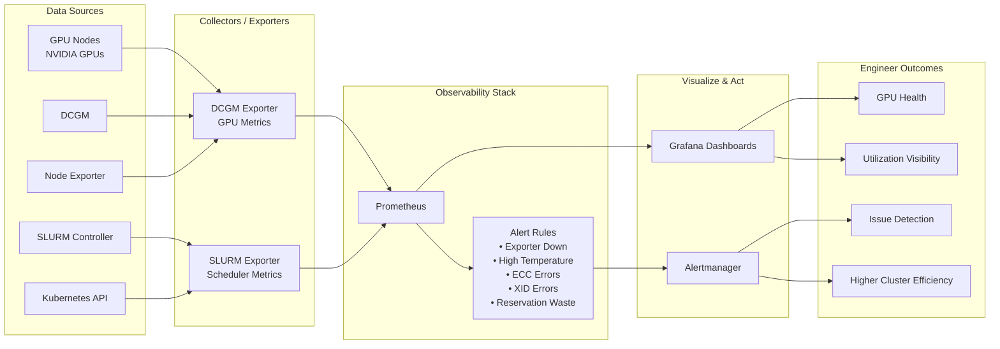
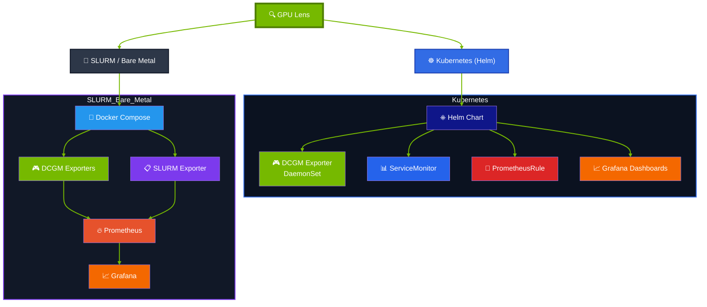
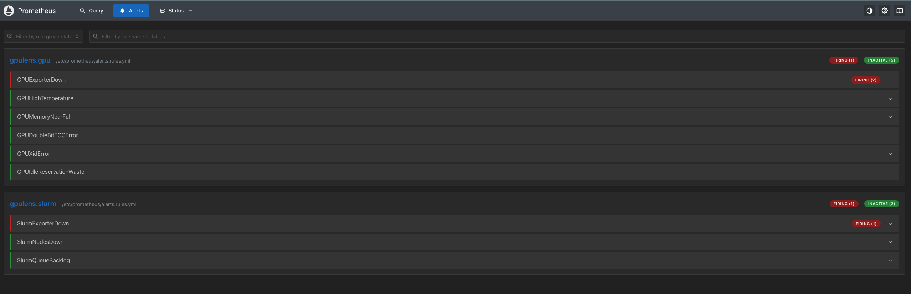
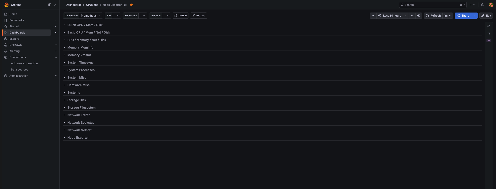

# GPU Lens ֎

> **Drop-in GPU + scheduler observability for clusters you already have.**


[](LICENSE)

Point gpulens at an existing GPU cluster and get two layers of visibility in
minutes 

1. **GPU Health** (utilization, memory, temperature, ECC, XID errors via
DCGM) 
2. **Scheduler State** (queue depth, node status). Works on Kubernetes
(Helm) or SLURM / bare-metal (Docker Compose).

Most monitoring repos are a lab you read. gpulens is a tool you install on
*your* cluster.


---


## What you get





### **DCGM exporter**
deployed to your GPU nodes (Helm DaemonSet with the right
GPU node selector + tolerations baked in), or scraped where you already run it.

### **Authored alert rules**
exporter down, high temperature, memory near-full,
double-bit ECC, XID errors, and a *reservation-waste* alert (GPU held but idle).
These ship as a `PrometheusRule` (K8s) or a Prometheus rules file (compose),
with tunable thresholds.

### **Proven dashboards**
fetched by ID (DCGM 12239, Node Exporter 1860) — never
hand-written JSON. See [`dashboards/`](dashboards/README.md).

### **Scheduler metrics**

via a SLURM exporter (bundled optionally, or scrape your
own).


### Architecture



----

# 👨‍💻  DEVELOP 

### 📟 Use the `go` cli 
This project is build along `go` cli. You can see all avialble options by running `./go` in terminal from root

```bash
# CLI
./go


# OUTPUT: 
Usage: ./go <command> [options]

Commands:
=== 0. 🛠  PREREQUISITES         ===
=== 1. ☸️  KUBERNETES            ===
=== 2. 🐳 COMPOSE / BARE-METAL   ===
=== 3. 📊 DASHBOARDS             ===
=== 4. 🧪 VALIDATE               ===

Enter a number to see details:
```

## Prerequisites

> You can use either `docker` or `podman` for Docker Compose. 

 
First thing first check required tools & install missing tools:

```bash

# Check your local setup
./go check

OUTPUT:
=== 🛠  PREREQUISITES-CHECK ===
✅ curl
✅ envsubst
➖ docker (optional, path-dependent)
✅ podman
✅ helm
✅ kubectl
➖ promtool (optional, path-dependent)
➖ shellcheck (optional, path-dependent)

```

## ✨ Build

Based on Workload you can choose 2 paths




## 1. 🥤 **SLURM HPC Batch Job**
> Monitor GPUs across a Slurm Worker


**Compose path:** Docker + Docker Compose. DCGM exporters running on your GPU
nodes (or use the SLURM profile to add a scheduler exporter).

### ⚙️ Configure
Copy `.env` file and fill it with your config.

  ```bash
  # Add .env file
  cp compose/.env.example compose/.env  
  
  ```
- edit `compose/.env` & add your SLURM details: scrape targets, ports, Grafana password.
- For `local` run leave it like this


### ▶️ Build
Next, build and Start Containers

```bash
# 🐳 Build containers
./go compose
```

**Dashboard will be open at**

- Prometheus Alerts : http://localhost:9090

  

- Grafana GPU Dashboard : http://localhost:3000

  


### ☠️ Clean Up

Kill the whales:

```bash
./go compose down
```

----

## 2. ☸️ **Kubernetes HPC Cluster**
> Monitor GPUs across a HPC k8 cluster

### Requirement
**Kubernetes path:** a k8 cluster with GPU nodes and the Prometheus Operator
  (e.g. kube-prometheus-stack) for `ServiceMonitor`/`PrometheusRule` to be
  consumed. Helm 3, kubectl.


### ⚙️ Configure
Everything cluster-specific is a knob — nothing is hardcoded.

- edit [`helm/gpulens/values.yaml`](helm/gpulens/values.yaml) — Add your image
  tags, GPU node selector/tolerations, `runtimeClassName`, ServiceMonitor labels,
  alert thresholds, optional SLURM alerts.


### ▶️ Build

```bash
  # Helm
  helm repo add gpulens https://hiteshsahu.github.io/gpulens   # (or: helm install from ./helm/gpulens)
  
  # Install Helm charts
  ./go helm
  
  # 🚢 Install K8
  ./go dashboards-k8s --namespace monitoring
```

### Helm quick reference

```bash
helm upgrade --install gpulens ./helm/gpulens -n monitoring --create-namespace \
  --set dcgmExporter.nodeSelector."nvidia\.com/gpu\.present"=true \
  --set serviceMonitor.additionalLabels.release=kube-prometheus-stack \
  --set prometheusRule.thresholds.gpuTempCelsius=80
```
---


### ☠️ Clean up
Sink the ship 

```bash
 ./go helm-down

```

---

## 🔎 TESTING 

```bash
./go lint
```

Runs 
- `helm lint`
- `helm template`
- `promtool check rules`
- `shellcheck` 

wire it into CI Pipeline on every push and you have test pipeline.

---

## ℹ️ Scope & honesty

GPU-Lens is a tool I built and use; it is **not** claiming production adoption it
hasn't earned. If you run it against your cluster and hit something, open an
issue real external usage is how it earns a stronger claim.

❌ A few things it deliberately does **not** do: 
- it doesn't stand up Prometheus/  Grafana *operators* for you on Kubernetes (it integrates with your existing
stack), and it doesn't provision a cluster (that's a different tool). 

✅ It does one job 

- observability — and tries to do it cleanly.

> SLURM exporter metric names vary by implementation. The alert rules match the
> common `vpenso/prometheus-slurm-exporter` names; adjust if you use another.

---

## License
*© 2026 [Hitesh Kumar Sahu](https://hiteshsahu.com) · Licensed under [Apache 2.0](https://www.apache.org/licenses/LICENSE-2.0)*


